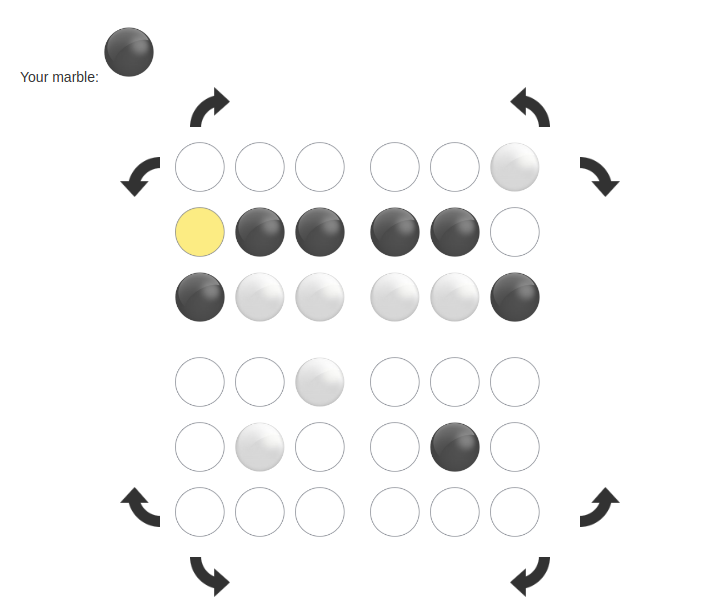

# Pentago

Implementation of a board
game [Pentago](https://en.wikipedia.org/wiki/Pentago). The AI player is
NegaMax algorithm with Alpha-Beta pruning written in C as NIFs. C code is
compiled and included in source code. Run `mix phx.server` and visit
`localhost:4000` to play. Currently only hot seat is possible for human vs human.

